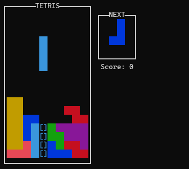

# Tetris.jl

[](https://travis-ci.org/mossr/Tetris.jl)

Tetris in the Julia REPL..._in one line of code!_

<p align="center">
  
</p>

<p align="center">
  
</p>

```julia
module Tetris (__init__(██="██", ■■="[]", S=" "^2, R="\e[31m$██\e[0m", B="\e[31;1m$██\e[0m", G="\e[32m$██\e[0m", L="\e[33m$██\e[0m", N="\e[34m$██\e[0m", M="\e[35m$██\e[0m", C="\e[36m$██\e[0m", W="\e[37m$██\e[0m", bs=[[S S C S; S S C S; S S C S; S S C S], [S B S S; S B S S; S B B S; S S S S], [S S N S; S S N S; S N N S; S S S S], [S S S S; S L L S; S L L S; S S S S], [S G S S; S G G S; S S G S; S S S S], [S S R S; S R R S; S R S S; S S S S], [S S M S; S M M S; S S M S; S S S S]], b=rand(bs), nb=rand(bs), rb=nothing, fd=false, go=false, rtx=false, h=false, fw=12, fh=18, sX=div(fw,2)-1, sY=2, X=sX, Y=sY, p=(X,Y), rcan=false, lr=[], fwlr=nothing, key=nothing, sc=0, t=0, sp=10, rf=(ls=0) -> ["┌" "────" "───" "T" "E" "T" "R" "I" "S" "────" "───" "┐"; "│" S S S S S S S S S S "│ ┌──NEXT──┐"; "│" S S S S S S S S S S "│ │$S$S$S$(S)│"; "│" S S S S S S S S S S "│ │$S$S$S$(S)│"; "│" S S S S S S S S S S "│ │$S$S$S$(S)│"; "│" S S S S S S S S S S "│ │$S$S$S$(S)│"; "│" S S S S S S S S S S "│ └────────┘"; "│" S S S S S S S S S S "│$(S)Score: $ls"; "│" S S S S S S S S S S "│"; "│" S S S S S S S S S S "│";"│" S S S S S S S S S S "│";"│" S S S S S S S S S S "│"; "│" S S S S S S S S S S "│"; "│" S S S S S S S S S S "│"; "│" S S S S S S S S S S "│"; "│" S S S S S S S S S S "│"; "│" S S S S S S S S S S "│"; "│" S S S S S S S S S S "│"; "└" "──" "──" "──" "──" "──" "──" "──" "──" "──" "──" "┘"], f=rf(), af=copy(f), dn= (lf, lnb) -> [lf[y,end] = replace(lf[y,end], r" │.{8,100}│"=>" │"*join(lnb[i,:])*"│") for (i,y) in enumerate(3:6)], c=(lb, lf, xy, rt::Bool=false) -> ([rt ? nothing : (rt = (lb[j,i] != S && lf[y,max(1,x)] != S)) for (i,x) in enumerate(xy[1]:xy[1]+3) for (j,y) in enumerate(xy[2]:xy[2]+3)], rt)[end], gd=(lb, lf, lX, ly, lp, rt::Bool=false) -> ([rt ? nothing : (!c(lb, lf, lp) ? (()->lp=(lX,py))() : rt=true) for py in ly:fh], (()->ly=lp[2]-1)(), (lp, ly))[end], sh=(lb) -> map(s->replace(s,██=>■■), lb), m=(lb, lf, xy, nf=deepcopy(lf)) -> ([lb[j,i] != S ? (nf[y,x] = lb[j,i]) : nothing for (i,x) in enumerate(xy[1]:xy[1]+3) for (j,y) in enumerate(xy[2]:xy[2]+3)], nf)[end], ds=(lf, lb, laf, lX, ly, lp, sb=sh(lb), np=gd(sb,lf,lX,ly,lp)[1]) -> m(lb, m(sb, laf, (np[1], np[2]-1)), lp), df=(lf, lb, lX, ly, lp, laf=lf, naf=(!go && !isempty(lp) ? ds(lf, lb, laf, lX, ly, lp) : laf)) -> println("\033[1;1H",join(join.([naf[i,:] for i in 1:size(naf,1)]), "\n"), "\033[$(fh+1);$(fw+1)H"), cr=(lrb, lp::Tuple, rt::Tuple=(false,lp)) -> ([!c(lrb, f, (lp[1]+r,lp[2])) ? (r == 0 ? rt=(true, lp) : rt=(rt[1] ? rt : (true,(lp[1]+r, lp[2])))) : nothing for (i,r) in enumerate([0,-1,1,-2,2])], rt)[end], cl=(lf) -> [all(map(line->!occursin(S,line), lf[i,2:end-1])) for i in 2:size(lf,1)-1], cc=ccall(:jl_tty_set_mode, Int32, (Ptr{Cvoid}, Int32), stdin.handle, true), buf=Channel{Char}(100), asy=let _asy=@async begin for __ in 1:72_000 put!(buf, read(stdin, Char)) end end end, ri=() -> (isready(buf) ? take!(buf) : nothing), eg=() -> (println("╔────────────────────╗\n", "║$S$S$(S)GAMEOVER$S$S$(S)║\n", "╚────────────────────╝\e[?25h"), exit())) = (println("\33[2J"), print("\e[?25l"), (()->f=rf())(), dn(f, nb), [(sleep(0.05), (()->t+=1)(), (()->fd=(t==sp))(), (()->p=(X,Y))(), (!isempty(lr) ? (df(f,b,X,Y,p), (()->sc+=length(lr))(), (()->fwlr=f[setdiff(2:size(f,1)-1,lr),2:end-1])(), (()->f=rf(sc))(), (()->f[(2+length(lr)):end-1, 2:end-1]=fwlr)(), dn(f, nb), sleep(0.05), (()->lr=[])(), df(f,b,X,Y,p)) : nothing), (()->key=ri())(), ((key=='a') ? ((!rtx ? (()->p=(X-1,Y))() : nothing), (()->rtx=true)()) : ((key=='d') ? ((!rtx ? (()->p=(X+1,Y))() : nothing), (()->rtx=true)()) : ((key=='s') ? (()->p=(X,Y+1))() : ((key=='w') ? ((!h ? ((()->(p,Y)=gd(b,f,X,Y,p))(), (()->fd=true)()) : nothing), (()->h=true)()) : (((key=='q') || (key=='e')) ? (((()->rb=((key=='q') ? rotl90(b) : rotr90(b)))(), (!h ? (()->((()->(rcan,p)=cr(rb,p))(), (rcan ? (()->b=rb)() : nothing)))() : nothing), (()->h=true)())) : ((key=='\e') ? ((()->go=true)()) : (()->h=false)())))))), rtx ? (sleep(0.025),(()->rtx=false)()) : nothing, !c(b,f,p) ? (()->(X,Y)=p)() : (()->p=(X,Y))(), (()->af=m(b,f,p))(), fd ? (!c(b, f, (p[1], p[2]+1)) ? (()->Y+=1)() : ((()->f[:]=af)(), (any(cl(f)) ? ((l=findall(cl(f)).+1)-> (f[l,2:end-1] .= W, (()->lr=l)()))() : (()->lr=[])()), ((()->X=sX)(), (()->Y=sY)(), (()->p=(X,Y))(), (()->b=nb)(), (()->nb=rand(bs))(), dn(f, nb), (()->go=c(b,f,p))())), (()->t=0)()) : df(f,b,X,Y,p,af), go ? eg() : nothing) for _ in 1:72000])) end
```

View the raw one-liner at [`Tetris.jl`](https://raw.githubusercontent.com/mossr/Tetris.jl/master/src/Tetris.jl) and an exanded/indented version at [`TetrisExpanded.jl`](https://github.com/mossr/Tetris.jl/blob/master/src/TetrisExpanded.jl). For an un-obfuscated version, see my [JuliaGaming implementation](https://github.com/JuliaGaming/Tetris/tree/master/Tetris-mossr).

### Installation
```julia
] add Tetris
```
Works across operating systems—even on Android using [Termux](https://github.com/termux/termux-packages/issues/58#issuecomment-529036798)!

### Playing
```julia
using Tetris
```
Running this will automatically start the game and exit the REPL at gameover.


## Controls (wasd + qe)
* `a` and `d` for left and right movement
* `s` to move down
* `w` to snap down
* `q` and `e` for left and right rotations
* `esc` to quit

## One-line Timelapse
In going from the full implementation (pushed to [JuliaGaming](https://github.com/JuliaGaming/Tetris/tree/master/Tetris-mossr)) down to one line, I recorded my screen for others to witness the abomination. (Click to zoom-in)

<p align="center">
  
</p>

Sidenote, this was actually recorded *after* I finished. I used the Sublime Text `ctrl-z` buffer all the way back, then hit record and used `crtl-y` to go forward.

# Why?
Great question. I first wanted to create Tetris in Julia, then made it a goal to reduce it down to one functional line of Julia code. I'm not using semicolons to break up separate Julia lines. Instead, I'm using tricks to define one inner `__init__()` function that encodes the game state variables and subroutines as function arguments and then runs the game loop when the [`Tetris`](https://raw.githubusercontent.com/mossr/Tetris.jl/master/src/Tetris.jl) module is loaded.

It works cross-plaform in pure Julia as I did not want to rely on any external libraries. Games are limited to 1 hour (72,000 iterations with a game clock of 0.05 seconds), as while loops would break my _"don't use semicolons to separate lines"_ rule (aside from Matrix row definitions). To play, run `using Tetris` or copy and paste the one-liner into the Julia REPL and enjoy!

---
[Robert Moss](http://web.stanford.edu/~mossr)
